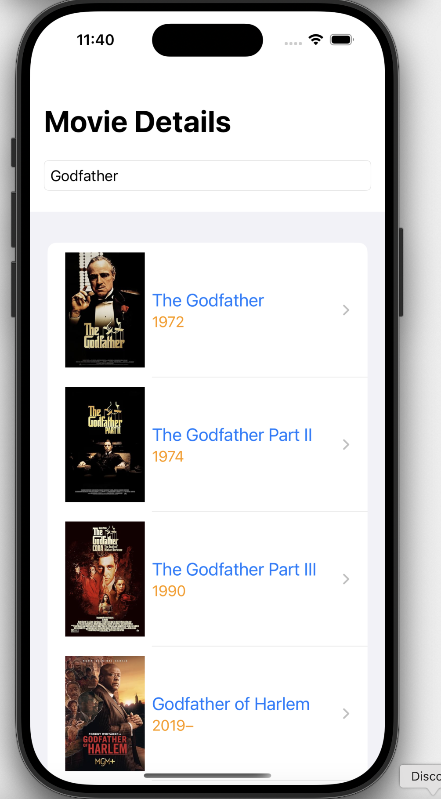

# Movie Search Application

The Movie Search Application is an iOS app developed using SwiftUI that allows users to view film details from the IMDb database. Users can search for specific film information by entering the IMDb ID of the movie.


## Features

- Display movie title, poster, year, director, writer, and awards.
- User-friendly interface for showcasing film details.
- Asynchronous data downloading for fast and efficient information retrieval.

## Screenshots

Here are some screenshots of the app:



## Requirements

- iOS 14.0 or later.
- Xcode 12 or later.
- Swift 5 or later.

## Usage

1. Clone the repository or download the ZIP file.

   ```bash
   git clone https://github.com/your_username/FilmAramaUyg.git
